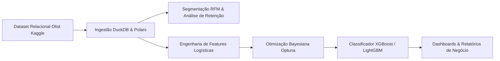

<div align="center">
  

  <br/><br/>

  <p align="center">
    <strong>Plataforma de Engenharia de Dados Colunar, Segmentação RFM &amp; Inteligência Preditiva</strong><br/>
    Processamento de alta performance com <strong>Polars &amp; DuckDB</strong>, análise estratégica de coortes e previsão de atrasos logísticos com <strong>XGBoost &amp; Optuna</strong> sobre <strong>100k+ pedidos</strong>.
  </p>
</div>

---

## 📌 1. Visão Geral da Arquitetura & Pipeline

O pipeline processa aproximadamente **100.000 pedidos transacionais** (2016–2018), integrando ingestão vetorizada, segmentação de clientes e esteiras de Machine Learning:



---

## 📁 2. Estrutura do Repositório

```text
olistbr-brazilian-ecommerce/
├── assets/                  # Banners dinâmicos e identidades visuais do projeto
├── data/                    # Diretório estruturado para armazenamento e cache dos dados brutos
├── resultado/               # Artefatos gerados: gráficos de alta resolução, relatórios e modelos
├── src/
│   ├── analysis/            # Análise Exploratória (EDA), segmentação RFM e lógica de negócio
│   ├── etl/                 # Módulos de download, ingestão vetorizada e transformações
│   ├── models/              # Treinamento de XGBoost/LightGBM e otimização com Optuna
│   ├── visualization/       # Geradores de gráficos interativos (Plotly/Seaborn)
│   ├── config.py            # Definições globais de caminhos, seeds e constantes
│   └── main.py              # Orquestrador do pipeline analítico e preditivo
├── requirements.txt         # Dependências do ecossistema Python (Polars, DuckDB, Optuna)
└── README.md                # Documentação técnica e guia de reprodução
```

---

## ⚙️ 3. Configuração do Ambiente

### Pré-requisitos
- Python 3.10+
- Git

### Instalação

```bash
# 1. Clone o repositório
git clone https://github.com/lucenfort/olistbr-brazilian-ecommerce.git
cd olistbr-brazilian-ecommerce

# 2. Crie e ative o ambiente virtual
python3 -m venv .venv
source .venv/bin/activate  # Linux/macOS
# .venv\Scripts\activate   # Windows

# 3. Instale as dependências
pip install --upgrade pip
pip install -r requirements.txt
```

---

## 🚀 4. Execução dos Componentes

### 4.1 Execução do Pipeline Analítico Completo
Para executar o download, a ingestão em DuckDB, as análises de negócio e o treinamento preditivo:

```bash
python3 src/main.py
```

Os relatórios analíticos, matrizes de confusão e gráficos de coorte serão gerados automaticamente na pasta `resultado/`.

---

## 📊 5. Principais Resultados & Insights de Negócio

### 5.1 Métricas Estratégicas & Comportamento
- **Volume Total Transacionado (GMV):** `R$ 13.278.587,41` analisados.
- **Taxa de Recompra:** `3.0%` (Perfil predominantemente transacional com forte dependência de aquisição contínua).
- **Segmentação RFM:** Agrupamento em 3 personas estratégicas (Campeões, Clientes em Risco e Novos Compradores) validados via *Silhouette Score*.

### 5.2 Performance Preditiva (Atrasos na Entrega)
- **Melhor Modelo:** XGBoost Classifier com ajuste bayesiano via Optuna.
- **Área sob a Curva ROC (ROC-AUC):** `0.7908`
- **Área sob a Curva Precision-Recall (PR-AUC):** `0.3596` (Foco em mitigar falsos negativos em classes desbalanceadas).

---

## 📜 Créditos & Conjunto de Dados

- **Dataset:** *Brazilian E-Commerce Public Dataset by Olist*
- **Fonte Oficial:** [Kaggle Dataset Olist](https://www.kaggle.com/datasets/olistbr/brazilian-ecommerce)
- **Licença:** [CC BY-NC-SA 4.0](https://creativecommons.org/licenses/by-nc-sa/4.0/).

---

## 👨‍💻 Autor

- **Luciano Silva de Arruda**
- Repositório Oficial: [`https://github.com/lucenfort/olistbr-brazilian-ecommerce`](https://github.com/lucenfort/olistbr-brazilian-ecommerce)
- LinkedIn: [Luciano Arruda](https://linkedin.com/in/lucenfort)
